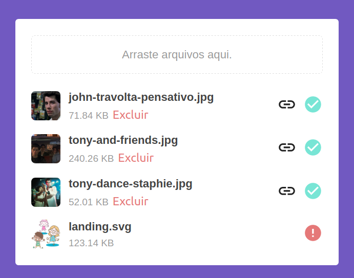

# :file_folder: Frontend Upload APP

## :warning: Project dependencies

- [backend_upload_api][1]

> Clone de project [backend_upload_api][1] and start application.

## :pencil: Pre-requisites

`NPM version 5.0.0+` See how to download and install in [NPM documentation.][2]

`Node version 10+` See how to download and install in [NPM documentation.][2]

`Git 2.13.0+` See how to download and install in [Git update version.][3]

## :clipboard: Setup

First clone the repository
```sh
$    git git@github.com:brunoMiranda8922/frontend_upload_app.git
$    cd frontend_upload_app
```

## :computer: Usage

```sh
$    npm install
```

```sh
$    npm run start    # and the application will be available on http:localhost:5001/
```
- After that, just upload the image




## :facepunch: How to contribute

Access the link to know how to [Contribute](./CONTRIBUTING.md)


## :boy: Author


[1]: https://github.com/brunoMiranda8922/backend_upload_api
[2]: https://docs.npmjs.com/downloading-and-installing-node-js-and-npm
[3]: https://gist.github.com/YuMS/6d7639d80b17523f6f01d90f285da509
